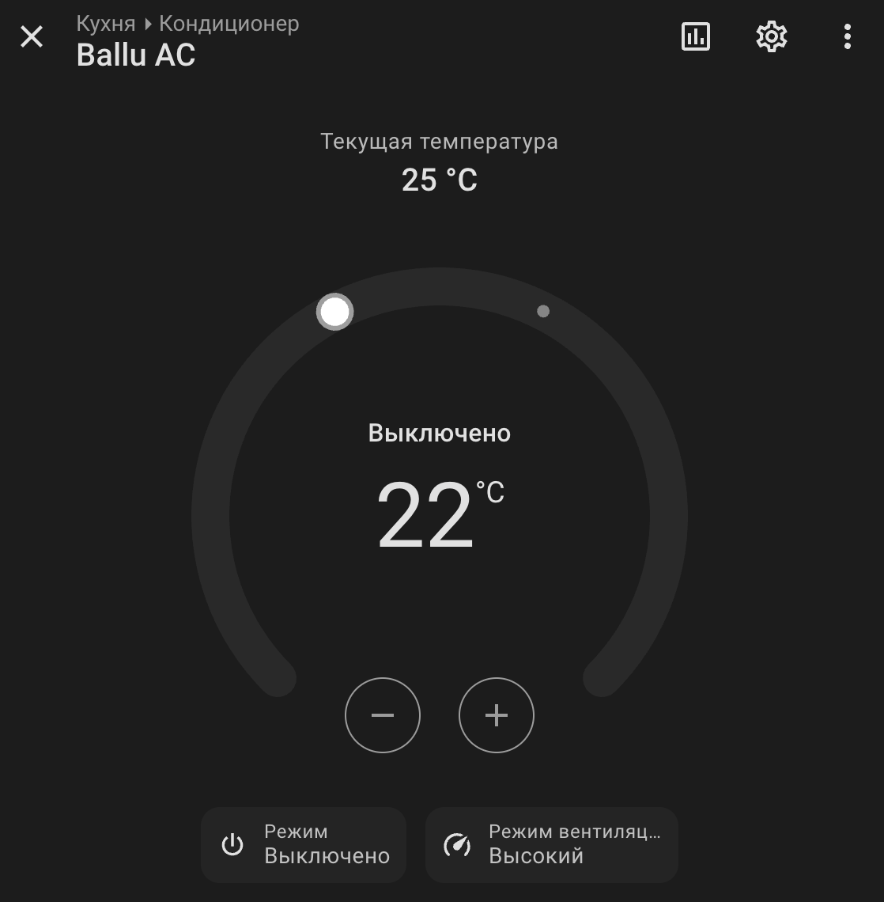

# Ballu AC Controller — ESPHome climate component

External component для ESPHome, который превращает UART-модуль управления
кондиционером (TCL/Ballu и клоны) в полноценный climate-объект Home
Assistant: включение/выключение, режим работы, целевая и текущая
температура, скорость вентилятора — всё читается с кондиционера и
управляется из HA в обе стороны.



## Почему отдельный компонент

Изначально кондиционер управлялся через community-компонент
[`tclac`](https://github.com/I-am-nightingale/tclac) — хороший и рабочий
проект с большим набором функций (качание/фиксация заслонок, пресеты,
светодиоды индикации). Для этого конкретного случая захотелось: сборку под
`esp-idf` вместо только `Arduino`, более простой набор функций без
ненужных для этой модели опций, и — самое главное — рабочие
`current_temperature`/`target_temperature`, которых в изначальной
конфигурации не хватало. В процессе получилось собрать компонент с нуля,
подтвердив по ходу каждое поле протокола экспериментально на живом
кондиционере.

## Статус: что подтверждено на реальном железе

Протокол производителем не документирован — формат пакетов подобран
экспериментально сравнением сырых UART-пакетов до/после изменения
состояния (см. историю коммитов и комментарии в коде). Проверено на
одном экземпляре кондиционера (модуль на базе Nologo ESP32-C3 SuperMini,
GPIO3/GPIO4, UART 9600 8E1):

- чтение (RX): режим работы, целевая температура, текущая температура,
  скорость вентилятора;
- запись (TX): включение/выключение, смена режима, целевая температура и
  скорость вентилятора — команды из Home Assistant реально меняют
  состояние кондиционера.

Не реализовано (осознанно, не нужно для этого проекта): качание/фиксация
заслонок, пресеты (eco/sleep/comfort), отдельная команда "турбо" из HA
(турбо только читается, если включено с пульта — отображается как `HIGH`).

## Совместимость с другими моделями

Кондиционеры этого семейства (TCL, Ballu и похожие клоны) используют
близкий UART-протокол, но детали могут отличаться от платы к плате —
у этого конкретного экземпляра, например, часть значений для управления
скоростью вентилятора пришлось подобрать заново, отдельно от того, что
предполагалось изначально. Чтение статуса, скорее всего, заработает без
изменений на многих похожих платах, а вот отправку команд (особенно
скорость вентилятора) может понадобиться перепроверить и донастроить под
конкретную модель — процесс описан в истории коммитов этого репозитория.

Если что-то не работает — включите `logger: level: DEBUG`, сравните
RX-пакет до/после реального изменения состояния кондиционера (через
пульт) и присылайте issue с логами.

## Установка

```yaml
external_components:
  - source:
      url: https://github.com/Vl-VSV/ballu-ac-controller.git
      type: git
      ref: main
    components: [ballu_ac]

esp32:
  variant: esp32c3
  framework:
    type: esp-idf

logger:
  baud_rate: 0  # обязательно — иначе логгер конфликтует с UART кондиционера

uart:
  baud_rate: 9600
  data_bits: 8
  parity: EVEN
  stop_bits: 1
  rx_pin: GPIO3
  tx_pin: GPIO4

climate:
  - platform: ballu_ac
    name: "Ballu AC"
```

Полный рабочий пример — [`ballu-ac.yaml`](ballu-ac.yaml).
